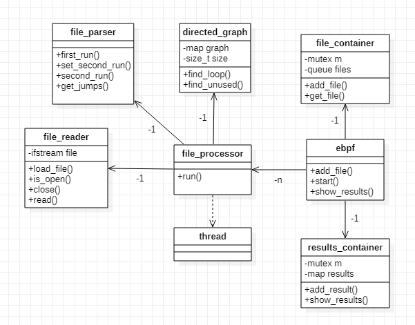

# Verificador de programas eBPF - Ejercicio N° 2

- **Francisco Bertolotto - 102671**
- **https://github.com/fbertolotto/7542-TP2**
- **2do Cuatri - 2020**

---

## Enunciado
Se propuso desarrollar una version simplificada del verificador eBPF. Esta implementación solo verificara que el programa en cuestión no posea loop y/o instrucciones sin utilizar. A su vez, el usuario puede especificar la cantidad de hilos que desee para el procesamiento multi-threading.
Cada hilo debe pedirle a una clase común el archivo a procesar y debe guardar los resultados en otra clase común. Se deben procesar en paralelo todos los archivos.

Los resultados impresos en pantalla seran:

- Si no posee ninguno problema:
> `<archivo> GOOD`
- Si posee un ciclo:
> `<archivo> FAIL: cycle detected`
- Si posee una instrucción sin usar y no un ciclo:
> `<archivo> FAIL: unused instructions detected`

Nota: Si posee tanto un ciclo como una instrucción sin usar, se imprimirá solo la alerta del ciclo.

## Diseño General

La estructura general del programa se divide en varios módulos. Por un lado se encuentra el parseador, aquel que recibe linea a linea del archivo y la procesa, obteniendo así los datos necesarios para detectar problemas.
Otro es el procesador de archivos, aquel que trabaja con la información obtenida del parseador para generar los resultados, ayudado por el grafo dirigido.
Y finalmente esta el programa principal, aquel que divide el labor entre los n threads, carga los archivos pedidos, finaliza las ejecuciones en paralelo e imprime los resultados finales.

## Problemas Principales

### Parsear datos

El problema principal a la hora de parsear los datos es el hecho de no saber que sigue. Al leer una linea esta podría tener un salto hacia otra linea que todavía desconocemos; tampoco estamos seguros que la linea siguiente exista (podría ser un salto de linea), por lo que no es seguro decir que avanza 1 linea.

Para solucionar esto se utilizo un método muy utilizado por los compiladores. El método de doble pasada.
En la primera iteración del archivo se guardan las lineas vaciás (para ignorarlas en el futuro), la dirección de cada label (su linea correspondiente) y el tamaño de cada linea (la cantidad de parámetros que tiene SIN incluir el label).

En la segunda iteración lo que se hace es analizar ahora cada palabra dentro de la linea, sabiendo si tiene label o no, podemos determinar donde esta el comando. 
Una vez obtenido el comando aplicamos la lógica, si es un salto con 1 parámetro, sabemos que salta si o si, si tiene 2 parámetros, es un salto condicional que, o se ejecuta, o avanza a la siguiente instrucción; y si tiene 3 parámetros es un salto condicional que siempre salta a la condición True o a la False. Si no es un salto, siempre avanza a la siguiente linea y si es un ret, entendemos que no avanza mas.

### Búsqueda de ciclos

Una vez obtenida la información necesaria de cada linea, es decir a donde puede llegar a saltar, se utilizada un recorrido DFS recursivo para buscar ciclos (cabe destacar que siempre se comienza por la primera linea, ya que es lo que haría el programa si se ejecuta). Al ser un grafo dirigido, se van creando "caminos" en los cuales no puede haber repetidos, ya que esto es lo que genera un ciclo.

### Búsqueda de instrucciones sin utilizar

Para saber si una instrucción no fue ejecutada, basta con comparar la cantidad de lineas visitadas por el recorrido DFS  con el tamaño original del archivo. Si existe una discrepancia significa que alguna linea es inaccesible (ya que siempre empiezo por la linea 1 del archivo). En otras palabras si el grafo tiene una sola componente conexa, todas las lineas son alcanzables; si no tiene una sola componente, existe al menos una instrucción que no pueden ser accedida a partir de la primera.

### Contenedor de Archivos Común

Como este archivo interactuá con varios hilos al mismo tiempo es posible provocar una race condition. Para evitarlo el contenedor posee un método bloqueante que impide que dos hilos o mas accedan a el al mismo tiempo. Cuando alguno le solicita un nuevo archivo, este se bloquea, analiza si quedan disponibles, si quedan le entrega el primero y se desbloquea. Si no quedan mas, también se desbloquea y le devuelve una cadena vacia (señal de que no quedan mas).

### Contenedor de Resultados Común

Al igual que el contenedor de archivos, los hilos intentaran guardar los resultados de manera simultanea. Para evitar en este caso un race condition, el objeto se bloquea durante la carga de resultados para evitar cualquier tipo de interferencia de otros hilos. De esta manera se garantiza que la carga de resultados sea segura.

### Procesamiento multi-hilo

Se crean tantos hilos como el usuario haya especificado y luego se les asigna una serie de pasos para repetir mientras existan archivos.
1. Solicitar archivo al objeto común a todos.
2. Si hay, abrirlo y procesarlo.
3. Generar los resultados a traves del grafo.
4. Guardar los resultados en el objeto común.
5. Paso 1.

De esta forma cada hilo funcionara hasta que se le indique que no existen mas archivos para procesar.

